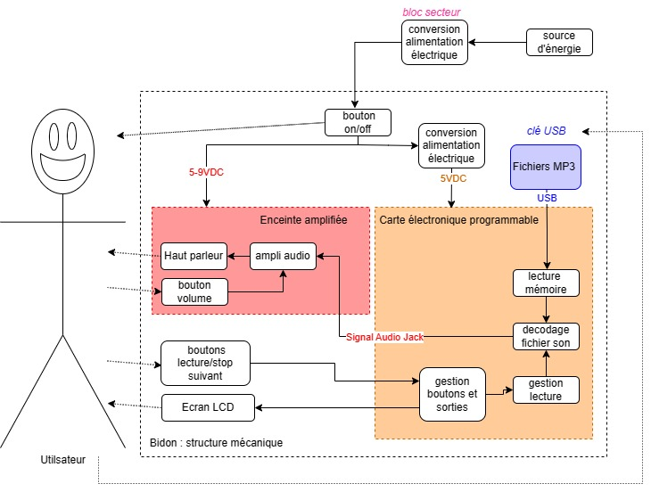

# Bienvenida del curso
primer encargo: crear la bitácora :)
Siguan las isguintes intrucciones para poder crear su bitacora que los acompañara el resto del curso ademas se vana revisra las bitacoras y estes abance es trabajo por semana en donde antes de la siguiente clase debe estar completada la btacora con el registro de ese día y de la semana y sus anotaciones y reflexiones de cada ejercicio

# Dispositivos Low-Tech e Interfaces Interactivas

## Estudiante
Nombre Apellido

## Proyecto / Bitácora
Nombre provisional

## Sobre mí
Breve presentación e intereses dentro del curso.

## ¿Qué entiendo hoy por Low-Tech?

Mi definición inicial es...

## ¿Qué quiero aprender?

Durante este semestre me interesa aprender...

## Proyecto
Aún por definir.

## Índice de sesiones

- [Sesión 01](...)
- [Sesión 02](...)
- [Sesión 03](...)

